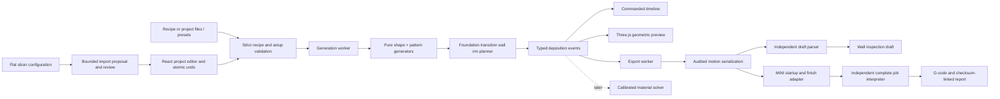

# Implementation architecture

Session 003, app/prepared engine 0.3.0, legacy wall engine 0.1.0, recipe schema 1, project/setup schema 2. This describes the actual code. [Research alternatives](research/architecture-options.md) retain the reasoning behind it; [status](status.md) records unfinished work.

## Boundaries

Session 003 adds `attachment.ts` beside the pure prepared-build planner. Its bounded circular-wave analysis runs with generation, so stale jobs are cancelled with their geometry. Reports/UI label it nominal matched-angle gap analysis; it is not a general contact solver. The ideal full-amplitude range can differ from a finite wall's envelope-limited range.

The first-layer planner insets the outer contour and scales every inner ring within it; upper layers stay nominal. Compensated joins are explicit non-extruding events. Setup/project v1 imports produce v2 with zero inset; new v2 setups propose 0.15 mm. `elefant_foot_compensation` imports through the same reviewed/provenanced numeric mapping as other supported settings.

Full export adds a deterministic CPU raster of deposited events, an independently implemented QOI encoder, final-text M73 annotation, and a separate structural LCD metadata audit. The adapter preserves G29 and checks an ordered two-segment purge. The progress annotator and final audit independently time quantized motion/stationary extrusion/dwell; thermal waits and dynamics remain absent. QOI prefix, pixel work, text/line and event budgets bound worker work. Encoded image comments are omitted only from the human-readable startup excerpt, never the downloaded program.

| Module | Owns | Must not own |
|---|---|---|
| `src/domain/types.ts` | Explicit units, recipe and event contracts | UI state, printer offsets, rendering objects |
| `src/domain/recipe.ts` | Versioned input validation, canonical known-field construction, numeric metadata | Executable scripts, silent clamping or unknown-field loss |
| `src/domain/shapes.ts` | Contours, radius extrema, world rotation for twist | Printer bed coordinates |
| `src/domain/patterns.ts` | Wave, triangle, Bezier-arch and bridge geometry/process events | G-code strings, browser state |
| `src/domain/generate.ts` | Weighted bands, global phase, resource preflight, diagnostics | Physical success claims |
| `src/domain/math.ts`, `stats.ts` | Length, volume and commanded-duration accounting | Firmware motion planning |
| `src/preview/` | Timeline indexing, geometric strand display and partial-event playback | Physical simulation or manufacturing export calculations |
| `src/export/` | Strict draft input checks, formatting, separate modal parse and post-format audit | Heating, homing or unverified profile macros |
| `src/print/setup.ts`, `project.ts`, `importProfile.ts` | Normalized setup, versioned project files, bounded flat config proposals/provenance | Executing imported scripts, interpreting arbitrary inheritance |
| `src/print/prepare.ts` | Explicit foundation/transition/wall/rim stages and placement | Firmware commands, rendering objects |
| `src/print/diagnostics.ts` | MINI envelope, deposited-width, speed/flow and setup checks | Claims of physical printhead clearance or material contact |
| `src/print/complete.ts`, `auditMini.ts` | MINI assembly and independent final-text state interpretation | UI-cached path trust, generic firmware emulation |
| `src/workers/` | Generation/export execution boundaries | Persistent storage or accounts |
| `src/ui/` | Editing, local files, views, undo, controls | Duplicated toolpath mathematics |

The pattern selector is an exhaustive typed dispatch over four generators, not a dynamic plugin language. New methods extend a discriminated type, the generator dispatch, control metadata and fixtures. This deliberately avoids a generic scripting system before concrete deposition needs justify one. The event stream already supports motion independent of contour geometry, so future anchored loops need not be squeezed into a perimeter-deformation model.

## Coordinates and mathematics

All domain distances are millimetres, times seconds, speeds mm/s, and deposited volumes mm³. XY is centred on the part; Z is up. Only the rendering adapter maps to Three.js axes `(x,z,-y)`. Only the draft adapter applies the reference-machine XY offset and converts feed to mm/min and volume to E-axis filament length.

For height fraction `t`, the nominal radius is:

`r(t) = (baseDiameter + (topDiameter - baseDiameter)t)/2 + belly·sin(πt)`.

The radius minimum is computed analytically from endpoints and any interior stationary point. Circle uses `(r cos θ, r sin θ)`. Ellipse scales local Y by `1/aspectRatio`. Rounded square uses exponent-4 superellipse coordinates `(r sign(cos θ)√|cos θ|, r sign(sin θ)√|sin θ|/aspectRatio)`. **Twist rotates these local XY coordinates**, rather than changing θ before non-circular mapping. Legacy wall Z starts at design offset 0.4 mm. The prepared-build planner explicitly places that wall at foundation top plus one foundation layer height.

The wall parameter spans `height/pitch` revolutions. A band's accumulated phase advances by `(repeatsPerTurn + phaseAdvanceDeg/360)·Δθ`, preserving phase across seams and band transitions. Fractional turns and local Z descents are permitted. Radial displacement changes the contour's scalar radius in its local frame; it is not a true surface-normal offset on non-circular forms.

Geometric effects blend at each band edge over `w = min(one motif's angular extent, half the band extent)`. With `u = min(distance to either band edge / w, 1)`, the envelope is `u²(3−2u)`. The interior reaches full requested amplitude; both boundaries meet the nominal surface exactly. Speed/flow modulation uses `1 + variation·sin(phase + π/4)`. Settings are evaluated at each commanded segment's documented generator sample; the firmware may execute a different instantaneous velocity.

- **Wave:** a continuous contour with signed sinusoidal Z/radial offsets.
- **Triangle:** piecewise straight spans through exact raised midpoint vertices.
- **Arch:** quadratic Bezier spans through specified endpoints and raised midpoint; the midpoint is sampled explicitly.
- **Bridge:** anchor → stationary deposit → dwell → rise → span → fall → anchor. A dwell never extrudes. No-op motion is omitted; explicit zero-volume deposits retain a comment marker in the draft.

Sampling uses motif density, a conservative travel-density estimate and a circular chord-density heuristic. The nominal 0.6 mm step and 0.05 mm circular chord settings are **not** general error bounds for arbitrary non-circular/modulated paths. Actual adaptive error control remains T12 work. Preflight rejects recipes requiring more than 100,000 events before large allocations. Rejection is a resource result, not a printability judgement.

## Extrusion and preview semantics

Moving volume is `π(strandDiameter/2)² · full 3D segment length · process flow · local flow`. Filament E is volume divided by `π(filamentDiameter/2)²` exactly once. This is an explicitly uncalibrated free-strand approximation; supported deposition can need a different section model.

The wall strand view draws a circular section inferred from volume/length. Prepared foundation/transition/rim segments use volume-equivalent rectangular sections with configured height `h` and width `volume/(length·h)`, shifted down `h/2`; planar first-layer geometry reaches Z=0. A local orthonormal frame follows sloped segments, where the global downward shift remains a documented display approximation. Method colours distinguish these build stages in gray. Stationary deposits are volume-equivalent spheres, not a predicted blob shape. Playback draws completed events plus the current event's fractional segment or deposit volume, so material does not appear ahead of the nozzle. Zero-volume motion remains visible in the nozzle-path view. Band colour is explanatory and does not imply multiple extruders/materials.

There is no gravity, thermal model, adhesion/contact solve, nozzle-envelope check, firmware acceleration model or claimed physical accuracy in this build. The nominal form, commanded path and geometric material view are named separately. Executed-motion and calibrated-material views are future adapters with their own model versions and measured validity domains.

## State, resources and persistence

The validated project (recipe plus setup) is the editable source of truth. Wall results retain their canonical recipe key; prepared results additionally carry `JSON.stringify({recipe, foundation})`. These are freshness/reproducibility keys, not security hashes. Each result stays paired with its exact recipe and foundation, including form and bead preview settings. Material-only edits do not regenerate geometry. Draft export captures an immutable recipe/result pair; complete export captures the project and regenerates/validates from persisted inputs in a separate worker, never trusting a cached result from another setup.

Changes debounce for 120 ms. Obsolete workers are terminated; request IDs also reject queued stale replies. Worker errors are keyed to their request so a later successful edit can recover. A stale viewport is labelled as updating/previous output, and current-recipe export remains disabled. The renderer allocates only the selected representation, disposes buffers/materials/instances, and draws only on changes or active camera/playback movement.

Recipes and projects are local JSON files, limited to 1 MB. Unknown versions/fields, non-finite values, invalid shapes and duplicate band IDs fail explicitly. Imported data never executes code. Undo keeps 80 complete project snapshots; no automatic browser save exists. Save before closing or refreshing. Legacy recipe import retains current setup; project import replaces both atomically. Profile proposals cannot apply after the source project changes. Optional WebMCP recipe tools call the same validator and editor actions, preserving setup without additional storage or service.

Schema 1 preserves editable recipe semantics; byte-identical toolpath replay across future engine releases is not yet guaranteed. Reports record the actual engine version; complete-job reports also record adapter version `mini-5.1.2/2`, the project, build key, preview assumptions and SHA-256 of the final G-code. Changes to persisted parameter meaning require an explicit schema migration/version change; algorithm refinements must retain engine provenance and explain path differences. Retain the actual G-code and report when an exact experiment record matters.

## Foundation planning

The foundation alternates outward/inward concentric contours so its final layer ends at the outer seam. Ring spacing uses the maximum section radius to support ellipse/squircle geometry. Layer changes are explicit 2 mm/s Z travel. All foundation/body/transition/rim work is included in the 100,000-event preflight.

Foundation and rim volume use stadium area `A=(width−h)h+πh²/4`, multiplied by full 3D segment length and recipe flow. The one-turn transition rises from foundation top to top plus `h`; each segment uses midpoint gap `g` in place of `h`, preventing a full-height bead from being extruded into a near-zero initial gap. Tests compare its sum against the quadratic-area integral with the known midpoint correction and check first/last volumes.

The wall placement is explicit, with a cubic smoothstep start envelope applied to Z/radial pattern offsets over `blendHeightMm`. A bound `blendHeight >= 1.125·maximumDownwardOffset` prevents the ramped wall from crossing its foundation reference. Requested amplitudes are preserved above this lead-in. This is a geometric bound, not proof of local nozzle contact, strand attachment or a printable wall. Rim turns continue the wall's global contour angle/twist and rise at foundation layer pitch.

## Draft audit and MINI adapter

The inspection draft uses G21/G90/M83/G92 E0, absolute XYZ, relative E, explicit feed, G0/G1/G4, and anchor comments. It omits all machine startup/end behavior and is named `.gcode.txt`. XYZ has three decimal places, E five, feed three, and dwell a 1 ms resolution. Positive extrusion, motion, feed or dwell that disappears in formatting fails explicitly. Event totals, parsed modal state, coordinates, volume and commanded duration are compared after formatting with per-event rounding accounting. Initial-approach duration is excluded because the starting machine position is unknown.

The independent draft parser supports this emitted dialect only; it is not a general slicer/firmware emulator. `exportAuditedMotion` exposes the already validated per-event command groups to the complete-job adapter without reparsing or modifying arbitrary user G-code.

The MINI adapter requires the recorded firmware family version, stock hotend, 0.4 mm nozzle and 1.75 mm filament. It establishes linear relative E (including `M200 D0`), resets speed/flow/pressure state, sets acceleration, waits for a positive bed target and 170 °C nozzle (zero bed target is explicit heater-off without a wait), homes/meshes, establishes Z clearance before XY, heats/purges/approaches, emits the stages, then retracts/lifts/parks/synchronizes and shuts down. Firmware input shaping is retained. See [pinned command research](research/mini-5.1.2-adapter.md).

`auditMiniGcode` independently interprets final text, requiring the exact setup targets, waits, modes, fan transition and controlled finish. It checks parsed coordinates/feeds/flow and tracks body E, dwell and move counts; the compiler compares these against quantized event expectations. Tests mutate or delete commands to prove that the checker can reject regressions. The parser is specific to this small dialect, not a model of thermal response or firmware execution. Nominal duration excludes heating/probing/homing and acceleration.

The [flat-config mapping](guides/profile-import.md) preserves source digest and imported baselines while excluding macro/script execution. No bundled upstream printer database exists. Additional firmware adapters should extend the normalized contracts and bring independent dialect fixtures; generative methods must stay machine-independent.

## Build and reuse

### Session 005 geometry and reference delivery

`print/pathContact.ts` consumes the actual prepared event path and stage table. It unwraps monotone polar advance and intersects each emitted chord with the current ray and the ray one revolution earlier. Full XYZ separation includes taper, belly and chord offsets; it does not search arbitrary nearby strands. The transition must cover one revolution; partial wall and rim revolutions retain their actual boundaries. Clockwise paths work. Stationary anchor/deposit/dwell positions are checked but their added volume is excluded. Travel, rotational reversals, zero-angle posts, invalid roles and nonpositive moving extrusion return applicability reasons. This is a nominal centreline diagnostic, not physical contact, executed motion or printhead clearance.

Analysis budgets cover 100,000 events, 512 compared revolutions, 250,000 sample intervals and a conservative four-million segment-scan estimate. Uniform ray samples include emitted segment boundaries from both compared paths. UI/report expose sampled extrema and angular coverage within the requested diameter; no general error bound or physical success probability is asserted. Generation stays in the existing cancellable worker and the report stays paired with the same build.

`domain/patterns.ts` now shares interior phase-boundary indexing between count preflight and emission. Eight machine epsilons scaled to accumulated phase remove floating-point duplicate endpoints, avoiding a stationary action on a numerically empty motif; actual partial motifs remain. Algorithm provenance is wall engine 0.2.0 and prepared engine 0.4.0. Persisted recipe schema 1 and setup/project schema 2 retain their field meanings.

`print/calibration.ts` owns study definitions, filename derivation and explicit foundation overrides. App loading and the batch CLI call the same helper. The next batch defaults to session-005 paths; `calibration:publish` adds the reviewed prepared files to the static public assets. Each job's project, report, SHA-256 and independent audit accompany it. Regression tests recompile all current reference downloads and require byte equality, so source changes cannot silently leave stale prepared files passing CI. Historical batches are not overwritten by the default command. `.gitattributes` prevents machine-file line-ending conversion.

Vite emits a static site with relative asset URLs and two workers. React and Three.js are separate chunks so editor controls do not wait for the rendering bundle. Fonts are served locally. GitHub Actions verify types, unit/integration tests, browser journeys, license drift and production build before Pages deployment. The source and lockfile are retained locally.

Implementation references: [Vite guide](https://vite.dev/guide/), [Vite static deployment](https://vite.dev/guide/static-deploy.html), [React](https://react.dev/learn/creating-a-react-app), [Three.js](https://threejs.org/docs/), [Vitest](https://vitest.dev/guide/), and [GitHub Pages workflows](https://docs.github.com/en/pages/getting-started-with-github-pages/using-custom-workflows-with-github-pages). Runtime licenses/notices and the distinct MPL build-tool dependency are recorded in [third-party policy](third-party-policy.md).
