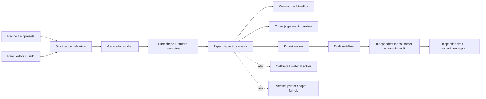

# Implementation architecture

Session 001, engine 0.1.0, recipe schema 1. This describes the actual code. [Research alternatives](research/architecture-options.md) retain the reasoning behind it; [status](status.md) records unfinished work.

## Boundaries

| Module | Owns | Must not own |
|---|---|---|
| `src/domain/types.ts` | Explicit units, recipe and event contracts | UI state, printer offsets, rendering objects |
| `src/domain/recipe.ts` | Versioned input validation, canonical known-field construction, numeric metadata | Executable scripts, silent clamping or unknown-field loss |
| `src/domain/shapes.ts` | Contours, radius extrema, world rotation for twist | Printer bed coordinates |
| `src/domain/patterns.ts` | Wave, triangle, Bezier-arch and bridge geometry/process events | G-code strings, browser state |
| `src/domain/generate.ts` | Weighted bands, global phase, resource preflight, diagnostics | Physical success claims |
| `src/domain/math.ts`, `stats.ts` | Length, volume and commanded-duration accounting | Firmware motion planning |
| `src/preview/` | Timeline indexing, geometric strand display and partial-event playback | Physical simulation or manufacturing export calculations |
| `src/export/` | Strict draft input checks, formatting, separate modal parse and post-format audit | Heating, homing or unverified profile macros |
| `src/workers/` | Generation/export execution boundaries | Persistent storage or accounts |
| `src/ui/` | Editing, local files, views, undo, controls | Duplicated toolpath mathematics |

The pattern selector is an exhaustive typed dispatch over four generators, not a dynamic plugin language. New methods extend a discriminated type, the generator dispatch, control metadata and fixtures. This deliberately avoids a generic scripting system before concrete deposition needs justify one. The event stream already supports motion independent of contour geometry, so future anchored loops need not be squeezed into a perimeter-deformation model.

## Coordinates and mathematics

All domain distances are millimetres, times seconds, speeds mm/s, and deposited volumes mm³. XY is centred on the part; Z is up. Only the rendering adapter maps to Three.js axes `(x,z,-y)`. Only the draft adapter applies the reference-machine XY offset and converts feed to mm/min and volume to E-axis filament length.

For height fraction `t`, the nominal radius is:

`r(t) = (baseDiameter + (topDiameter - baseDiameter)t)/2 + belly·sin(πt)`.

The radius minimum is computed analytically from endpoints and any interior stationary point. Circle uses `(r cos θ, r sin θ)`. Ellipse scales local Y by `1/aspectRatio`. Rounded square uses exponent-4 superellipse coordinates `(r sign(cos θ)√|cos θ|, r sign(sin θ)√|sin θ|/aspectRatio)`. **Twist rotates these local XY coordinates**, rather than changing θ before non-circular mapping. Nominal Z currently starts at design offset 0.4 mm; a future foundation planner will own placement explicitly.

The wall parameter spans `height/pitch` revolutions. A band's accumulated phase advances by `(repeatsPerTurn + phaseAdvanceDeg/360)·Δθ`, preserving phase across seams and band transitions. Fractional turns and local Z descents are permitted. Radial displacement changes the contour's scalar radius in its local frame; it is not a true surface-normal offset on non-circular forms.

Geometric effects blend at each band edge over `w = min(one motif's angular extent, half the band extent)`. With `u = min(distance to either band edge / w, 1)`, the envelope is `u²(3−2u)`. The interior reaches full requested amplitude; both boundaries meet the nominal surface exactly. Speed/flow modulation uses `1 + variation·sin(phase + π/4)`. Settings are evaluated at each commanded segment's documented generator sample; the firmware may execute a different instantaneous velocity.

- **Wave:** a continuous contour with signed sinusoidal Z/radial offsets.
- **Triangle:** piecewise straight spans through exact raised midpoint vertices.
- **Arch:** quadratic Bezier spans through specified endpoints and raised midpoint; the midpoint is sampled explicitly.
- **Bridge:** anchor → stationary deposit → dwell → rise → span → fall → anchor. A dwell never extrudes. No-op motion is omitted; explicit zero-volume deposits retain a comment marker in the draft.

Sampling uses motif density, a conservative travel-density estimate and a circular chord-density heuristic. The nominal 0.6 mm step and 0.05 mm circular chord settings are **not** general error bounds for arbitrary non-circular/modulated paths. Actual adaptive error control remains T12 work. Preflight rejects recipes requiring more than 100,000 events before large allocations. Rejection is a resource result, not a printability judgement.

## Extrusion and preview semantics

Moving volume is `π(strandDiameter/2)² · full 3D segment length · process flow · local flow`. Filament E is volume divided by `π(filamentDiameter/2)²` exactly once. This is an explicitly uncalibrated free-strand approximation; supported deposition can need a different section model.

The strand view draws a circular section inferred from volume/length. Stationary deposits are volume-equivalent spheres, not a predicted blob shape. Playback draws completed events plus the current event's fractional segment or deposit volume, so material does not appear ahead of the nozzle. Zero-volume motion remains visible in the nozzle-path view. Band colour is explanatory and does not imply multiple extruders/materials.

There is no gravity, thermal model, adhesion/contact solve, nozzle-envelope check, firmware acceleration model or claimed physical accuracy in this build. The nominal form, commanded path and geometric material view are named separately. Executed-motion and calibrated-material views are future adapters with their own model versions and measured validity domains.

## State, resources and persistence

The validated recipe is the single editable source of truth. Generator results carry `JSON.stringify(recipe)` from canonical parsed field order; this is a freshness/reproducibility key, not a security hash. A result stays paired with the exact recipe that produced it. Export captures an immutable recipe/result pair and uses a separate worker; it cannot silently switch to a newer design while the dialog is open.

Changes debounce for 120 ms. Obsolete workers are terminated; request IDs also reject queued stale replies. Worker errors are keyed to their request so a later successful edit can recover. A stale viewport is labelled as updating/previous output, and current-recipe export remains disabled. The renderer allocates only the selected representation, disposes buffers/materials/instances, and draws only on changes or active camera/playback movement.

Recipes are local JSON files, limited to 1 MB. Unknown versions/fields, non-finite values, invalid shapes and duplicate band IDs fail explicitly. Imported data never executes code. Undo keeps 80 recipe snapshots; no automatic browser save exists. Save before closing or refreshing. Optional WebMCP tools call the same validator and editor actions, with no additional storage or service.

Schema 1 preserves editable recipe semantics; byte-identical toolpath replay across future engine releases is not yet guaranteed. Experiment reports record engine 0.1.0 and the generating recipe. Changes to persisted parameter meaning require an explicit schema migration/version change; algorithm refinements must retain engine provenance and explain any resulting path differences. Retain the exported report/draft when an exact experiment record matters.

## Draft audit and later printer adapters

The inspection draft uses G21/G90/M83/G92 E0, absolute XYZ, relative E, explicit feed, G0/G1/G4, and anchor comments. It omits all machine startup/end behavior and is named `.gcode.txt`. XYZ has three decimal places, E five, feed three, and dwell a 1 ms resolution. Positive extrusion, motion, feed or dwell that disappears in formatting fails explicitly. Event totals, parsed modal state, coordinates, volume and commanded duration are compared after formatting with per-event rounding accounting. Initial-approach duration is excluded because the starting machine position is unknown.

The independent parser supports this emitted dialect only; it is not a general slicer/firmware emulator. A later normalized printer/material record must provide provenance, capabilities, actual firmware, offsets/envelopes and explicit start/end semantics. Profile parsing must not execute arbitrary PrusaSlicer macros. The next stage adds that adapter and foundations without putting machine-specific behavior into the generative methods.

## Build and reuse

Vite emits a static site with relative asset URLs and two workers. React and Three.js are separate chunks so editor controls do not wait for the rendering bundle. Fonts are served locally. GitHub Actions verify types, unit/integration tests, browser journeys, license drift and production build before Pages deployment. The source and lockfile are retained locally.

Implementation references: [Vite guide](https://vite.dev/guide/), [Vite static deployment](https://vite.dev/guide/static-deploy.html), [React](https://react.dev/learn/creating-a-react-app), [Three.js](https://threejs.org/docs/), [Vitest](https://vitest.dev/guide/), and [GitHub Pages workflows](https://docs.github.com/en/pages/getting-started-with-github-pages/using-custom-workflows-with-github-pages). Runtime licenses/notices and the distinct MPL build-tool dependency are recorded in [third-party policy](third-party-policy.md).
