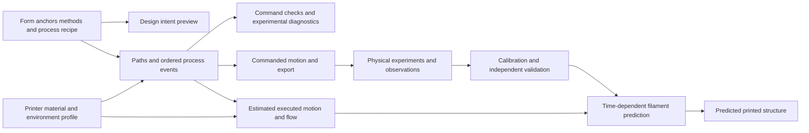

# Discovery brief

Research and scoping snapshot from 11 September 2026, before implementation. The product manager subsequently approved the build. See [current status](status.md) for delivered capabilities and [implementation architecture](architecture.md) for selected libraries and measured software behavior; proposals below retain their historical context.

## Finding

The product is an experimental deposition studio: makers design paths, anchors, sequencing and material behavior as well as the overall form. The agreed alpha includes sinusoidal walls, triangles, arches and an initial pause-and-move bridge sequence, with non-circular cross-sections, twist and combined process controls. Sagging/free-space loops, accurate filament simulation, integrated lamp brackets/socket interfaces and multi-printer compatibility are required later capabilities. General-purpose slicing of arbitrary imported models is a separate decision.

The confirmed target is a Prusa MINI+ with a 0.4 mm nozzle and white or black eSUN PLA. The first vase should have a decorative woven wall with small visible gaps and be used dry or with a liner. The app should run from GitHub and from a local checkout; editable recipes use download/upload and ordinary Git versioning. Firmware, modifications, and exact filament product line remain open. None of the patterns researched has been physically validated on this particular printer.

## Existing work

FullControl demonstrates a mature conceptual approach: define print movements and process settings directly, then produce machine instructions. Its original research includes non-planar and process-driven structures. This is strong evidence for the design approach, not a guarantee that any particular pattern or setting will work on the MINI. [Gleadall, *FullControl GCode Designer*, 2021](https://doi.org/10.1016/j.addma.2021.102109)

AmiSlicer is a close technical reference for sinusoidal perimeter deformation and woven structures, although its current public repository withholds the runnable application. FullControl, Bread, non-planar slicer forks, and smaller generators occupy different parts of the problem; the [project inventory](research/project-inventory.md) records their licenses, gaps, and reuse recommendations. No source has been copied into this project.

There are already close product precedents. Laalten advertises an in-browser lamp/vase editor, woven patterns, hardware features, and G-code export. Its site describes sign-in for downloads and publication of downloaded designs; these are vendor claims, not features tested in this review. LuminaForge describes a working parametric vase/STL editor and lists lamp generation among future work. Neither observation establishes that these products solve our target deposition behavior. [Laalten](https://laalten.com/), [LuminaForge](https://github.com/potalora/luminaforge)

gcoordinator is a particularly useful reuse candidate: its MIT-licensed Python library provides path-based modeling, preview, and G-code generation. Selected algorithms may be adaptable to the proposed browser engine with retained notices and validation; adopting the package itself would require a Python execution strategy. [gcoordinator repository](https://github.com/tomohiron907/gcoordinator), [license](https://github.com/tomohiron907/gcoordinator/blob/main/LICENSE)

The product priority is expanding creative and process options, including intentionally unstable or unsupported deposition. Reference recipes, prediction error and physical observations help makers explore; they should not restrict the generator to a catalog of successful prints. No market-exclusivity claim is made.

## The central design correction

Keep an editable design recipe as the source of truth. Derive the shape preview and print path from it. Do not make STL the required intermediate representation: an STL describes a surface and does not carry the ordered extrusion and speed instructions that create these effects.

The interface combines a form editor, method-specific sliders, and a motion/material timeline. An arch, triangular path or timed bridge has its own geometry and process recipe, rather than being approximated by a sine-wave preset. The printed-result preview is intended to predict meaningful material behavior and improve through measured calibration; the nozzle trajectory is a separate view.

## Effects to distinguish

| Effect | What changes | Recommended treatment |
|---|---|---|
| Conventional spiral | Height increases continuously along a perimeter. | Baseline control print and reference behavior. |
| Z waves | Local height oscillates around the rising spiral. | Early experiment; requires contact, clearance, and Z-motion limits. |
| Radial waves | The nozzle moves inward/outward relative to the profile. | Early experiment; analyze adjacent-turn support and apparent strand crossings. |
| Combined weave | Z/radial motion and phase are coordinated across turns. | Candidate first decorative pattern after coupon tests. |
| Triangles and arches | Vertices, curved spans, anchors and repetition define the structure. | Agreed alpha methods, with geometry and process sliders. |
| Pause-and-move bridges | Deposition and cooling/pauses alternate with controlled movement between anchors. | Initial sequence in the agreed alpha; timing and predicted strands must be visible. |
| Sagging/free-space loops | Filament is intentionally deposited through air, with controlled anchors, excess length and timing. | Required M6 capability; the predicted strand may differ substantially from the nozzle path. |
| Speed/extrusion texture | Material deposition changes along the path. | In first-release scope; a separate calibration track because feedrate commands do not specify executed speed history. |
| Pauses and stationary deposition | Waiting, nozzle motion and material delivery have independently defined phases. | Represent as explicit process events; waiting alone does not command extrusion. |

Conventional vase mode already increases Z gradually and normally has planar bottom layers. What makes the proposed effects distinctive is the added local modulation and deposition control. [Prusa, *Layers and perimeters*](https://help.prusa3d.com/article/layers-and-perimeters_1748)

The engineering evidence and limitations are expanded in [toolpath feasibility](research/toolpath-feasibility.md). The proposed early ordering is based on controllability and testability; it does not dismiss the more experimental effects.

## First product scope and validation strategy

A desktop browser studio with a form/anchor editor, distinct deposition generators, process controls, motion playback and predicted printed geometry. It saves recipes and exports machine-specific instructions. Continuous vase printing is one strategy; deliberate interruptions and separate structural regions are supported where the method requires them.

Use a baseline spiral and reference structures for comparison. Preserve choices outside tested print ranges and expose experimental outcomes such as sag, collapse or weak attachment as diagnostics. Keep machine-instruction correctness and measured simulation accuracy separate from print stability. Small parameter sweeps and recorded observations support both creative discovery and model calibration.

The [milestones](milestones.md) explicitly include sagging/free-space loops (M6), higher-fidelity physics (M7), integrated lamp hardware (M8) and additional printers (M9), with supporting architecture and early prediction work starting sooner. These capabilities require specifications and evidence, not a new decision about whether to include them. Arbitrary STL import, general slicing and cloud services remain uncommitted.

Physical simulation requires its own development and validation program. The [simulation report](research/filament-simulation.md) evaluates reduced strand models and higher-fidelity routes; no runtime or accuracy has been measured for this project yet. The requirement is measurable prediction, with declared domains and uncertainty as fidelity improves.

## Discussion proposed during discovery

Review the [PRD](PRD.md) as one package: editor scope, effects, export semantics, design saving, intended audience, and milestone acceptance. A reference image or named example supplied in the conversation would help define “woven-looking” more precisely; it is not a prerequisite for continuing the scope discussion.

The proposed deployment is GitHub Pages, which publishes static HTML/CSS/JavaScript from a repository. A browser-only generation engine fits that model, with a local development server for the checkout. Selected recipe files are versioned through ordinary Git workflow; automatic in-app commits are excluded by the chosen saving approach. [GitHub Pages documentation](https://docs.github.com/en/pages/getting-started-with-github-pages/what-is-github-pages)

Existing slicer profiles should be reused as requested. The proposed first step is importing a supported PrusaSlicer configuration and mapping relevant fields into a versioned profile with separate non-planar extensions. The [profile reuse report](research/profile-reuse.md) records current sources, format complexity, and licensing questions.

## Research limits

This review inspected primary project documentation, license files, firmware documentation, and research publications. It did not benchmark candidate code, run competing products behind sign-in, print samples, or verify commercial licensing arrangements. Advertised features and repository test counts are not independently verified performance evidence. Candidate dependencies must be reviewed at the exact version before adoption.
