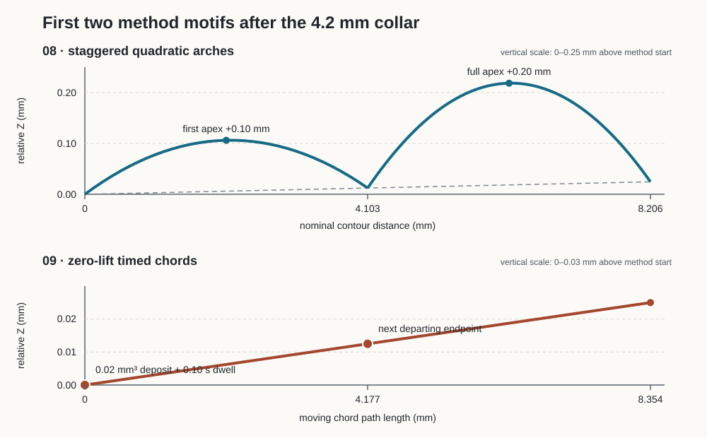

# Next prints — miniature, arches and timed endpoints

A and B are reported successful, including printer preview and time display. This batch uses that feedback to introduce shape and deposition changes separately. **These three new jobs have passed software checks and are awaiting physical results.** Original 01–06 remain historical references.

Open [NP3DP](https://argarot.github.io/NP3DP/), choose **Prepare print**, and use the prepared download on each test card. Those downloads use the exact batch settings below, independent of editor changes. **Load** opens an editable version; **Export print** then generates a new file from your current settings.

## Print order and files

| Order | Prepared G-code | What changes | Commanded time |
|---|---|---|---|
| 1 | [07 Mini vase B](https://argarot.github.io/NP3DP/print-tests/session-005/07-mini-vase-b.gcode) | B's wave and speed on a gently tapered, bellied vase | 25m 18s; initial LCD remaining time rounds to 26 min |
| 2 | [08 Arch coupon](https://argarot.github.io/NP3DP/print-tests/session-005/08-arch-coupon.gcode) | A smooth collar, then staggered quadratic arches | 14m 37s; initial LCD rounds to 15 min |
| 3 | [09 Held span V2](https://argarot.github.io/NP3DP/print-tests/session-005/09-held-span-v2.gcode) | A smooth collar, then straight chords with stationary endpoint deposits and timed holds | 15m 37s; initial LCD rounds to 16 min |

These estimates include commanded movements, extrusion and dwell. Heating, homing, mesh probing and firmware dynamics add time. The user has confirmed the display works; its elapsed-time accuracy has not been measured.

Keep the corresponding **Project** and **Print report** from the same card with your observations. Reports include the exact G-code SHA-256. The [batch manifest](../evidence/session-005-calibration.json) records software evidence. Editable projects are also in [examples/next-prints](../../examples/next-prints/).

## Shared printer setup

Prusa MINI family, stock hotend, firmware **5.1.2+13478**, 0.4 mm nozzle, 1.75 mm eSUN PLA Basic. MINI versus MINI+ remains unconfirmed. Prepared files use:

- Nozzle 215 °C first layer → 210 °C body; bed 60 °C.
- Fan off for the foundation, then 100%; wall speed 6 mm/s.
- Three 0.20 mm foundation layers, 0.45 mm lines at 20 mm/s; 0.15 mm first-layer elephant-foot inset.
- 4 mm pattern lead-in; flow multiplier 1.0 and nominal strand diameter 0.45 mm.
- Mandatory **G28 → G29 mesh leveling**, final nozzle heat wait, then the two-part front purge at Y6, X5 → X65 → X135.
- QOI LCD previews, M73 progress/remaining time, and normal retract/lift/park/shutdown.

Load a study in the editor retains your printer/material settings, filament diameter, flow multiplier and compensation. Study geometry and foundation structure are applied explicitly; **08 has no finish rim**, while 07 and 09 have one. Import the supplied project if you want the complete fixed setup in the editor.

## 07 — transfer B to a shaped miniature

The wall has a 34 mm base, 38 mm top, 24 mm nominal height and 1 mm radial belly. Finished commanded height is 25 mm including foundation, transition and rim. The maximum belly diameter is about 38.42 mm.

Pitch **0.40 mm**, wave amplitude **0.12 mm**, 14 repeats plus 180° phase advance and 6 mm/s match B. Only overall shape and height change. The original 03 used 0.60 mm amplitude and is not the next file to print.

The new app panel compares actual emitted segments in XYZ one revolution apart. It includes the radial change that the old constant-circle Z calculation omitted. The first three wall turns remain fully within the nominal 0.45 mm comparison distance; later turns deliberately include gaps. This is geometry evidence, not a prediction of weld strength or nozzle clearance.

Observe startup attachment, the widening wall, opening consistency and any dragging. Measure the base/top diameters if possible and photograph the side against a ruler.

## 08 — small staggered arches

The 32 mm diameter wall is 10.2 mm high: **4.2 mm conventional collar + 6 mm arches**, above the shared foundation/transition. Pitch is 0.30 mm. Each arch rises 0.20 mm, with 24 repeats plus 180° phase advance. The pattern covers 20 turns / 490 complete motifs; endpoints alternate with previous arch peaks.

The first arch turn compares against the collar; later arches compare against earlier arches. Their nominal separation varies as intended. **There is no finish rim:** reviewing the emitted geometry found that a plain rim would approach the final arches to about 0.0065 mm. Omitting it leaves the arch test's top exposed and avoids introducing that separate interaction. The delivered commanded height is about 11 mm.

Watch the collar-to-arch transition and where endpoints meet previous arches. Record any snagging, dragged strands, opening shape or detachment. The preview shows the commanded quadratic arch, without cooling, sag or bead-contact simulation.

## 09 — timed endpoint comparison

[Independent method and sequence review](../evidence/session-005-method-review.md) explains the geometry behind this comparison.

Same 32 mm diameter, 10.2 mm wall, 4.2 mm collar and 0.30 mm pitch. The next 20 turns contain **480 straight chords**, about 4.18 mm long, with aligned endpoints. Each chord has:

1. A stationary **0.02 mm³** deposit at its start.
2. A **0.10 s** hold, with no extrusion during the hold.
3. Extrusion while moving along the chord to the next endpoint.

There are exactly 480 deposits, 480 holds and 480 spans; the final endpoint has no extra trailing deposit/hold. The holds contribute 48 seconds. Lift and radial excursion are zero. One finish rim is included.

This isolates timed endpoint deposits and straight-chord behavior. The collar and previous turns provide nominal support along the chords, so **this is not a free-space sag or loop validation print**. Look for consistent small endpoint welds, oversized blobs, corners pulling away and differences from the arch coupon.

The old lifted bridge extrudes down to an anchor and then back up the same post. Its 0.80 mm lift exceeds its 0.30 mm rise per turn, putting later anchors into previous posts. That geometry remains editable, with explicit diagnostics; the new test avoids it. Lifted spans and free-space loops remain required development work.

## During each print and afterwards

Use the same calibrated sheet and material as A/B. Clear old material from the bed and front purge strip. Confirm the preview, mesh probing, continuous second purge segment, foundation and fan transition. Print one file at a time; inspect it before starting the next. Stop if loose material accumulates or the nozzle drags the print.

For each file record: filename, any settings changes, sheet/spool colour, overall result, first failing height if applicable, actual elapsed time and photos with a scale. Keep new observations separate from the A/B feedback. If 07 fails, report it before trying a taller shaped vase; a failure in 08 or 09 should be diagnosed as its own method.

Next development will use these results to refine shaped-wall attachment and endpoint deposition, then add an explicit lift/return sequence for more ambitious spans. Accurate filament simulation, free-space loops, integrated lamp fittings and more printers remain on the roadmap.
