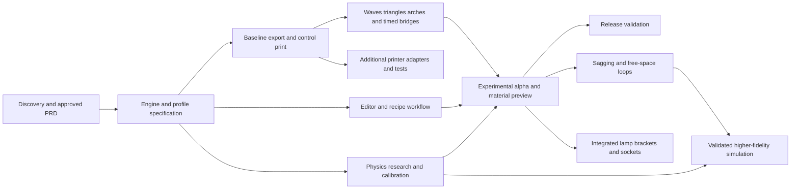

# Milestones and task gates

**Implementation authorized on 11 September 2026.** The scope and staged roadmap are approved; numeric physical targets and hardware gates remain open. Current task evidence is recorded in [status](status.md) and [session 004](sessions/004-retry-feedback.md). Implemented generators do not imply a passed physical gate.

Each gate has an artifact and observable evidence. The agreed alpha includes sinusoidal walls, triangles, arches, and an initial pause-and-move bridge sequence. Sagging/free-space loops, accurate filament simulation, integrated lamp hardware, and multi-printer compatibility are committed later capabilities. Detailed task estimates and numeric thresholds follow PRD approval and feasibility measurements.

Separate generator availability, physical prediction accuracy, and tested-recipe repeatability. Experimental print failure is an acceptable outcome and a source of data; it does not by itself block a usable generator. Incorrect command generation or unsupported claims of preview accuracy fail the relevant gate. Physical observations must come from real tests and cannot be replaced by agent execution.

## M0 — Discovery and scope

Session 003 implementation and session 004 feedback: T11 records actual firmware/stock hotend/filament grade with MINI variant unknown; T15/T25 include reviewed config import and first-layer compensation. T20–T23 include foundations, transition/rim, full MINI output, mandatory mesh/purge, LCD metadata/progress, command limits and independent parsing. T22 now has reported working preview/time display. T24 has **a reported successful original control, a failed original wave, and reported successful A/B retries**. Revised miniature and held-span studies have not been delivered. G1 needs agreed numerical targets and measured clearance; G2 still needs dimensional and repeatability evidence. M3/M4 physics and M6–M9 remain unfinished.

| Task | Output | Gate evidence |
|---|---|---|
| T00 Research prior art and licenses | Project inventory, feasibility report, architecture options | Important claims have primary citations; unknowns are explicit. |
| T01 Confirm initial product choices | Decision log | Printer, wall character, audience, delivery, effect set, and export meaning resolved. |
| T02 Agree PRD, required roadmap and phasing | Approved PRD revision | Product manager approves remaining product choices; committed later features are not treated as exclusions. |
| T03 Select dependency strategy | Recorded route and candidate notices | Licensing consequences accepted before code incorporation. |

**G0: passed for the independent-code/permissive-dependency route on 11 September 2026.** The product manager approved implementation; reviewed dependencies and exact notices are inventoried. This does not choose the product's distribution license or authorize unreviewed upstream profile/code incorporation.

## M1 — Engine and printer specification

| Task | Output | Gate evidence |
|---|---|---|
| T10 Define recipe, units, process graph and versions | Schema and architecture decision | Shared semantics across geometry, anchored paths, timed process events, printer adapters, material prediction and export. |
| T11 Record actual MINI setup | Firmware/profile, machine envelope, material and nozzle record | Confirmed configuration; start/end behavior traced to the selected firmware. |
| T12 Define path mathematics and precision | Profile, spiral, phase, sampling, and extrusion spec | Analytical fixtures and tolerances reviewed independently. |
| T16 Define playground composition | Non-circular contour/twist model, anchor/repetition scheme and primitive controls | Supports waves, triangles, arches and timed bridge phases; permits future loop generators without assuming every path is a perimeter. |
| T13 Define checks and failure classes | Validation specification | Distinguishes blocking errors, unknowns, estimates, and physical validation. |
| T14 Establish baseline workload | Reference design/computer/browser and benchmark criteria | Numeric error and performance targets agreed before implementation acceptance. |
| T15 Specify slicer profile reuse | Supported source format, license route, mapped fields, provenance and extension schema | Reuses baseline settings without claiming upstream profiles validate non-planar effects. |
| T17 Define preview contracts and experiments | Commanded/executed/material state, model versions, observations and error metrics | First material-preview domain and accuracy targets specified; calibration and independent validation data separated. |
| T18 Define printer adapter contract | Capability schema, dialect mapping, geometry/motion/material extensions | MINI-family implementation cannot hard-code printer-specific behavior into generative methods. |

**G1:** Interfaces, machine assumptions, and numerical acceptance targets are explicit. Unknown clearance geometry is not silently treated as zero.

## M2 — Baseline generator and control print

| Task | Output | Gate evidence |
|---|---|---|
| T20 Implement profile, contour/twist and planar base planner | Geometry and base operations | Circular/non-circular dimensions, joins, volume accounting, and invalid contours pass fixtures. |
| T21 Implement conventional spiral body/finish | Complete baseline toolpath | Continuous body; controlled transition and finish. |
| T22 Implement MINI serializer and independent output parser | Text G-code plus parsed representation | Modal-state and coordinate/extrusion comparisons pass after formatting. |
| T23 Implement diagnostic classes | Validation report | Malformed/unresolvable jobs rejected; expected gaps/sag and likely print failure remain advisory. Intentional deposition contact is distinguished from machine-envelope violations. |
| T25 Implement selected profile adapter | Validated normalized printer/material settings | Source fixtures, inheritance/flattening, units, macros and unknown-field handling tested. |
| T24 Print baseline coupon/container | Recorded physical control sample | Agreed basic adhesion, dimensions, and extrusion criteria pass. |

**G2:** A conventional output from our engine works on the recorded machine. This validates a baseline only; it does not validate non-planar patterns.

## M3 — Distinct deposition generators and initial physical prediction

| Task | Output | Gate evidence |
|---|---|---|
| T30 Implement composable Z/radial/speed/extrusion modifiers | Deterministic effect operations and status | Tests cover order, frames, phase, extrema, twist, non-circular contours, speed/flow accounting, and joins. |
| T31 Extend clearance/contact and motion/flow checks | Diagnostics with profile assumptions | Invalid cases are caught; approximations and unsupported cases are identified. |
| T32 Generate a controlled coupon series | Recipes varying one primary factor at a time | Each sample has traceable parameters and expected observations. |
| T33 Run supervised physical tests | Photos, observations, dimensions, failures | No promotion based solely on a rendering or commanded coordinates. |
| T34 Choose first woven family and parameter envelope | Versioned tested preset | Product manager accepts the appearance; repeatability criteria pass. |
| T35 Validate speed/extrusion behavior | Controlled tests and stated process-model limits | Separates commanded settings, estimated firmware response, and observed effects; no tested label without evidence. |
| T36 Implement triangles and arches | Named primitives with geometry/process sliders | Each emits its own geometry and sequence; vertices, anchors, repeats and transitions have fixtures beyond sinusoidal deformation. |
| T37 Implement pause-and-move bridging | Anchor/dwell/move/extrusion/cooling phases | Time/state sequence survives generation, serialization and playback; a dwell is not substituted for extrusion. |
| T38 Build the first material-prediction model | Progressive preview for supported deposition and initial spans | Model responds to relevant geometry/process settings; quantitative accuracy is measured within a stated initial domain, with uncertainty elsewhere. |
| T39 Collect a deposition evidence set | Reference prints and documented failures for each implemented family | Comparison covers a non-sinusoidal method and timed span, not only a successful conventional vase. |

**G3:** All four agreed alpha families and their process controls are implemented, computationally checked and physically investigated. The material model meets the agreed initial accuracy target in its stated domain. A useful non-sinusoidal example and timed-span example are recorded; unproven combinations remain available as experiments. Recipe repeatability and failed-print predictions are reported separately.

## M4 — Experimental alpha

| Task | Output | Gate evidence |
|---|---|---|
| T40 Build the experimental shape/method editor | Usable desktop playground | Non-circular forms, twist, waves, triangles, arches and bridge phases have sliders; methods can be repeated and combined. |
| T41 Build motion/material inspection | Timeline, commanded and estimated executed motion, predicted structure and diagnostics | Extrusion, pauses, travel, anchors and evolving spans visible; predicted material is not conflated with the nozzle trajectory. |
| T42 Add worker cancellation and resource budgets | Responsive generation | Reference workload meets agreed latency/memory limits; stale results cannot replace current ones. |
| T43 Add recipe round trip and exports | Local save/load and downloads, if approved | Determinism/version handling and independent file checks pass. |
| T44 Exercise reference designs end to end | Woven vase plus distinct-method examples | User can edit, inspect, save, export and investigate results; required controls and supported preview accuracy meet their gates. |

T40–T43 can run alongside M2–M3 after interfaces are settled. Pattern parameters must remain experimental until G3.

**G4:** The product manager can explore all agreed alpha methods through the complete workflow, including failure-prone choices. One stable vase alone does not satisfy the alpha; a generator that emits incoherent commands or a decorative-only “physical” preview also fails. Promotion of individual tested recipes requires their own evidence.

## M5 — First release

| Task | Output | Gate evidence |
|---|---|---|
| T50 Repeat representative jobs and review regressions | Release validation record | Numerical/browser checks and method-specific prediction tests pass; successful and failing print outcomes are documented. Repeatability claims are scoped to tested recipes. |
| T51 Finish user documentation and examples | Getting started, limits, troubleshooting | A new tester can follow the workflow without hidden machine assumptions. |
| T52 Audit licenses, dependencies, and distribution | License/notice manifest and release inventory | Exact versions reviewed; copied assets/code have traceable permission. |
| T53 Package GitHub and local delivery | Reproducible Pages build and local run instructions | Repository subpath, workers/assets, refresh behavior and local/hosted engine parity verified. |

**G5:** Release meets the agreed scope, records tested hardware/material bounds and known limitations, and receives product acceptance.

## M6 — Sagging strands and free-space loop deposition

**Required capability, agreed after the first alpha.** Extend the primitive/event model to deliberate sag, excess deposited length, unsupported motion, attachment and reconnection. It must offer more than a loop-shaped nozzle curve.

| Task | Output | Gate evidence |
|---|---|---|
| T60 Define sag/loop process families | Geometry, anchor, flow, timing and cooling controls | Intent, commanded path and predicted strand shape are distinct; target droop is not misrepresented as guaranteed output. |
| T61 Implement loop generators and sequencing | Editable/repeatable loop and sag recipes | Phase/state/volume, travel and reconnection fixtures pass. |
| T62 Extend material prediction | Time-evolving sag, stretching, contact and possible collapse within declared scope | Predictions change appropriately with supported process parameters; unsupported phenomena are visible. |
| T63 Run loop/bridge experiment matrices | Physical examples and failure regions | Shape, sag, contact and timing measured against predictions for a declared material/profile. |

**G6:** Users can design, inspect and export sagging and free-space loop recipes with meaningful controls and evidence-backed predictions in the accepted domain. Record a realized example of each accepted method; unrestricted combinations need not be stable. Findings feed M7 calibration and validation.

## M7 — Accurate physical filament simulation

**Required capability. Research begins at M1; an initial model is delivered in the alpha.** This milestone expands predictive accuracy and the range of processes modeled.

| Task | Output | Gate evidence |
|---|---|---|
| T70 Research and select physics models | Baselines and candidate dynamic models | Explain coverage of gravity, cooling, rheology, flow/pressure history, stretching and contact; no claim of exact physics from a static tube render. |
| T71 Build calibration and independent validation sets | Versioned measurements and uncertainty estimates | Fit and held-out prints are separate; include failed and borderline cases, different spans, timing and flow settings. |
| T72 Implement/refine the material solver | Progressive interactive mode and quality mode | Replays the same deposition recipe and execution estimates; solver assumptions/version recorded. |
| T73 Measure predictive accuracy | Error report by phenomenon and process domain | Quantify centerline/sag/diameter/contact/opening/timing error against agreed thresholds and compare with simpler baselines. |
| T74 Benchmark compute and integration | Browser resource/latency measurements | Agree fidelity/latency budgets; request a product decision before requiring an external service or local solver. |

**G7:** The solver meets agreed physical-error and runtime targets on held-out prints for the supported domains. Report calibration scope and unknowns. If targets are missed, the capability remains unfinished at that fidelity; retain useful earlier previews without relabeling them accurate.

## M8 — Integrated lamp brackets and sockets

**Required capability.** Generate bracket, socket-interface and related mounting geometry as integrated regions of a lamp design, with a coherent combined print plan.

| Task | Output | Gate evidence |
|---|---|---|
| T80 Select fitting and assembly requirements | Measured hardware dimensions, retention, access, clearances, material and load/thermal targets | Product manager chooses the first fitting and intended assembly. |
| T81 Implement hardware geometry controls | Integrated bracket/socket interface, cutouts and attachment transitions | Dimensioned geometry and fit coupons agree; feature location is editable with the decorative body. |
| T82 Implement multiple-region sequencing | Structural/decorative region plan with travel and state transitions | Integrated hardware does not force an invalid continuous-vase assumption; command and preview checks pass. |
| T83 Validate an assembled example | Fit, retention and scoped assembly evidence | Demonstrates actual integrated hardware. A separate adapter alone cannot close the milestone. |

**G8:** At least one chosen fitting works in an integrated generated design under its documented requirements. Additional fittings extend the same library with their own evidence.

## M9 — Multi-printer compatibility

**Required capability.** Interfaces begin at M1; implementation and testing can proceed alongside M6–M8 once the core export contract is stable. This numbering does not make multi-printer work dependent on completed lamp hardware or full simulation.

| Task | Output | Gate evidence |
|---|---|---|
| T90 Select second printer/firmware and profile source | Target record and capability mapping | Product manager confirms available hardware; code/data licensing recorded. |
| T91 Implement additional adapters | Profile import, commands, setup/finish, limits and compensation | Dialect/state fixtures and independent export parsing pass; unsupported operations are explained. |
| T92 Re-target recipes and predictions | Same recipe evaluated for each machine | Recompute timing, flow, clearance and material-prediction scope; do not translate by string substitution alone. |
| T93 Compare physical results | Cross-printer print and prediction evidence | Demonstrate supported methods on at least two printers and separate profile compatibility from physically tested support. |

**G9:** The same design workflow targets at least two printers through reviewed adapters, with explicit capability differences and physical evidence. More profiles may be experimental without falsely inheriting tested status.

## Other work awaiting commitment

Arbitrary model import, a general slicer, cloud sharing/accounts, and printer-network control remain separate product decisions. Required capabilities in M6–M9 need detailed specifications and thresholds, not a fresh decision about whether they belong in the product.

## Team workflow

The lead coordinates design, owns the shared interfaces, reviews toolpath mathematics and printer behavior, integrates branches/files, and reports gate status. Assign routine bounded UI, schema, fixtures, documentation, and inventory work to Terra or Luna when appropriate. Assign substantial implementation, debugging, and independent numerical review to Sol. Reserve Astra-level work for orchestration and the most difficult geometry, collision, or integration problems. These are task-routing choices, not claims of measured model performance.

Use at most the available concurrent slots, including the lead. The lead assigns explicit file ownership and prevents unplanned nested delegation from exhausting the team. Independent agents may review code but do not mark their own physical validation complete. Parallelize independent work; serialize shared-interface changes and integration.

For every task, record scope, inputs, files owned, acceptance criteria, evidence, and unresolved issues. Run meaningful numerical/property tests, output-state checks, and end-to-end workflows; avoid tests that merely restate the implementation. Product decisions stay in the decision log. No new feature becomes scope because an agent found it convenient to add.
